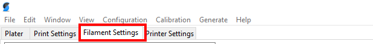
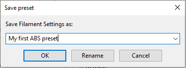
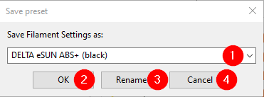

# Filament Configuration

This section will explain all there is to know about filament configuration in
SuperSlicer. The document follows the structure of SuperSlicers menu order.

Please note that this document references to the expert's view of SuperSlicer,
so if one is missing options ensure that the expert view in the top right 
corner is activated.

## Filament Settings

All of SuperSlicer's filament settings are found in the "Filament Settings"

### Filament presets management

In the filament tab you will notice a dropdown on upper left side of the
screen. This is the filament preset selector.

The filament preset selector allows for a convinient way to manage different
types of filament. Since every type of filament (ABS, PLA, PETG, etc.) needs
different parameters it is handy to keep all available filament types
organized in presets so these may later be used with minimal effort.

The save icon allows for the following actions.

One can either choose a new name for storing the current filament settings.

Or one can update an existing filament preset with the current filament
settings. 

1. Select a specific filament preset to save the current values as or type in
the name of a new filament preset

2. Update the selected filament preset with the current values.

3. In order to use the rename functionality an existing filament preset must
be selected and then actively renamed as if a new preset would be saved and then
the rename button may be pressed.

4. Clicking cancel aborts the save preset action without storing any modification.

#### Sytem presets

foo

#### User presets

foo

